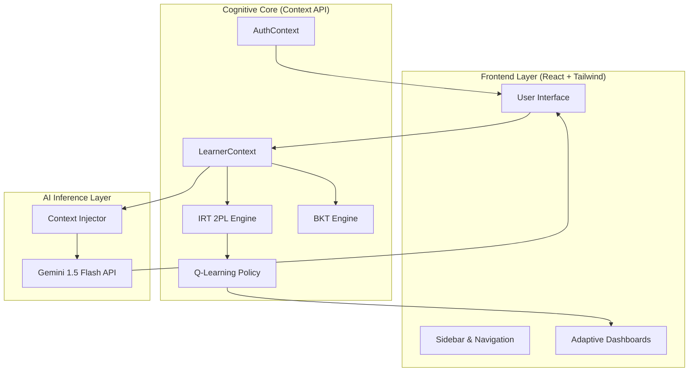

# CogniPath AI: System Architecture v5.0

CogniPath is an **Adaptive Cognitive Learning Platform** that utilizes real-time biometric telemetry simulations and advanced psychometric modeling (IRT/BKT) to dynamically scale educational content.

---

## 🏗️ High-Level Architecture

The system is built on a **Decoupled Neural Architecture**, separating the UI presentation from the heavy-lift mathematical and AI inference layers.

---

## 🧠 Core Mathematical Engines

### 1. Item Response Theory (IRT) - 2PL Model
The IRT engine calculates the **Global Ability (θ)** of the student based on their interaction history.
- **Discrimination (a):** How well a "question" distinguishes between high and low ability.
- **Difficulty (b):** The inherent complexity of the task.
- **Estimation:** Fixed-point iteration to update $\theta$ after every interaction.

### 2. Bayesian Knowledge Tracing (BKT)
Tracks mastery for individual concepts (e.g., Logic, Memory, Spatial).
- **$P(L_0)$:** Initial probability of knowing the concept.
- **$P(T)$:** Probability of transition from unlearned to learned.
- **$P(S)$ / $P(G)$:** Slip and Guess probabilities.

### 3. Q-Learning (Reinforcement Learning)
A policy-driven engine that sits atop the IRT/BKT layers.
- **State ($s$):** $(\theta, \text{Mastery}, \text{Fatigue})$.
- **Action ($a$):** Increase/Decrease/Maintain difficulty.
- **Reward ($r$):** Alignment with the "Zone of Proximal Development" (ZPD).

---

## 🛰️ Neural Telemetry & State Management

The `LearnerContext` acts as the **Neural Bus** for the application, synchronizing the student's cognitive state across all dashboards.

| State Variable | Purpose | Sync Method |
| :--- | :--- | :--- |
| `theta` ($\theta$) | Global cognitive ability score. | IRT Update |
| `mastery` | per-concept proficiency mapping. | BKT Update |
| `fatigue` | Simulated mental drain based on time/difficulty. | Decay Function |
| `overload` | Binary flag triggered by excessive cognitive load. | Threshold Logic |

---

## 🤖 AI Interaction Layer (Ask CogniPath)

The **Gemini 1.5 Flash** integration utilizes **Contextual Hyper-Prompting**.

1.  **Extraction:** The system pulls the current $\theta$ and `Mastery` from `LearnerProvider`.
2.  **Injection:** Injects this telemetry into the system instructions for Gemini.
3.  **Synthesizing:** Gemini generates a response that is aware of the student's *actual* learning progress, not just the chat history.

---

## 🔐 Security & Persistence
- **AuthContext:** Manages student sessions via persistent `localStorage`.
- **Protected Routes:** React Router guards ensure that neural data is only accessible to authenticated student links.
- **State Recovery:** IRT/BKT states are serialized and saved to `localStorage`, allowing for non-volatile "resume" capabilities.

---

## 🛠️ Tech Stack
- **Engine:** Vite + React + Tailwind CSS v4
- **State:** React Context API + Custom Hooks
- **Logic:** Vanilla JS (Psychometric Math)
- **AI:** Google Generative AI (@google/generative-ai)
- **Icons:** Lucide React
